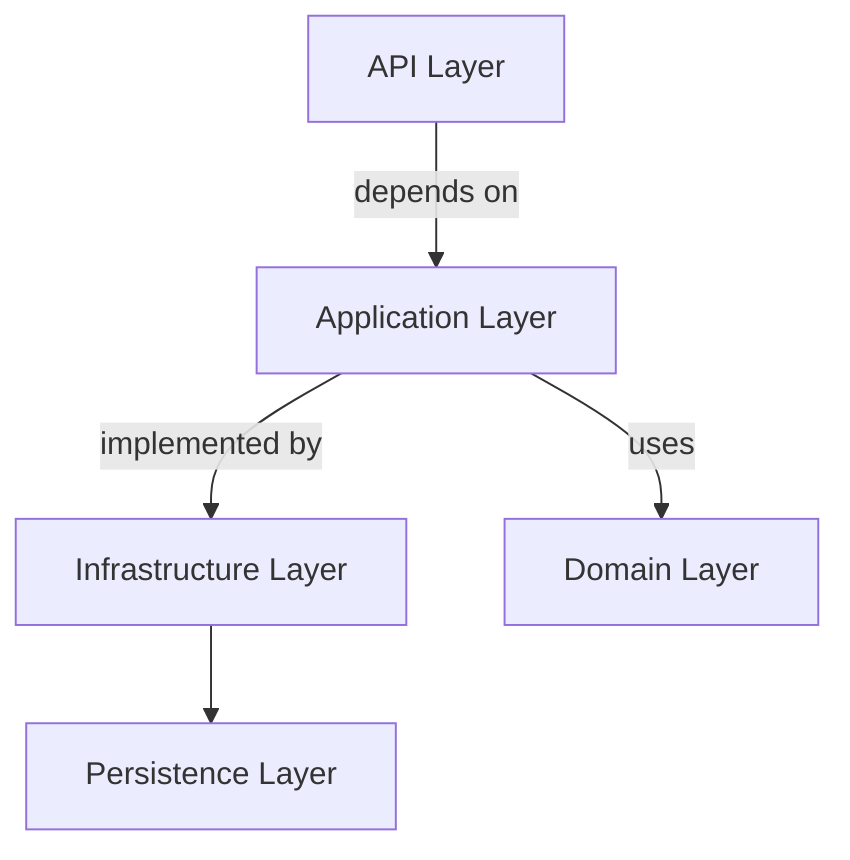
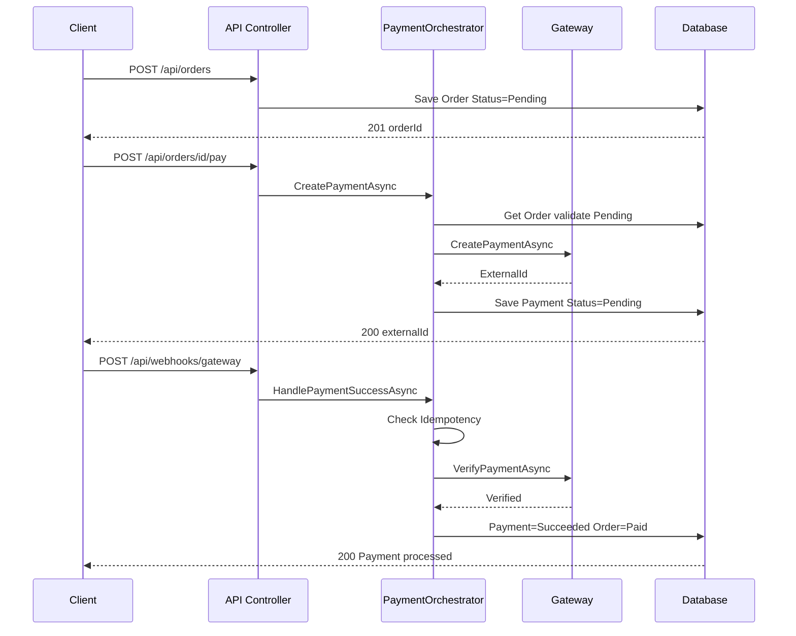
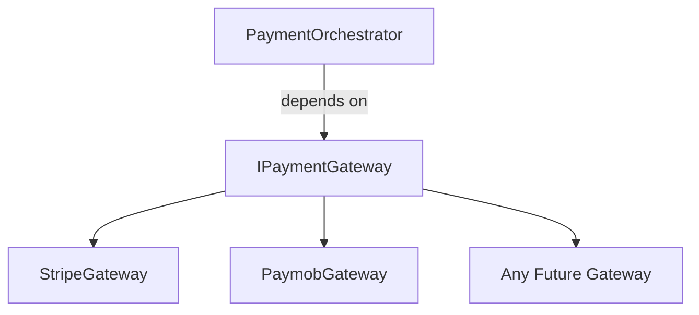
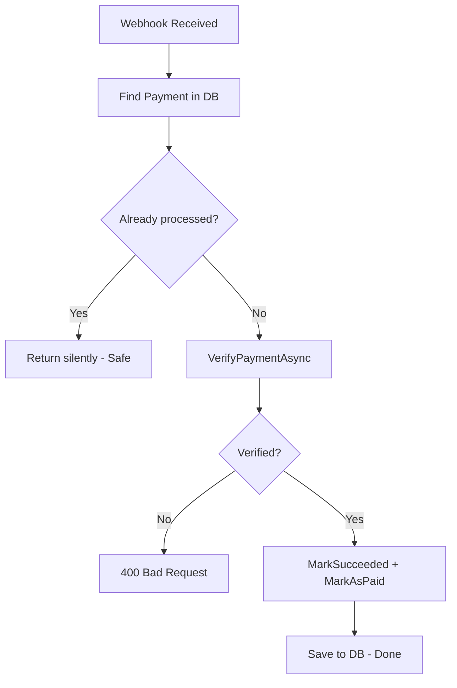
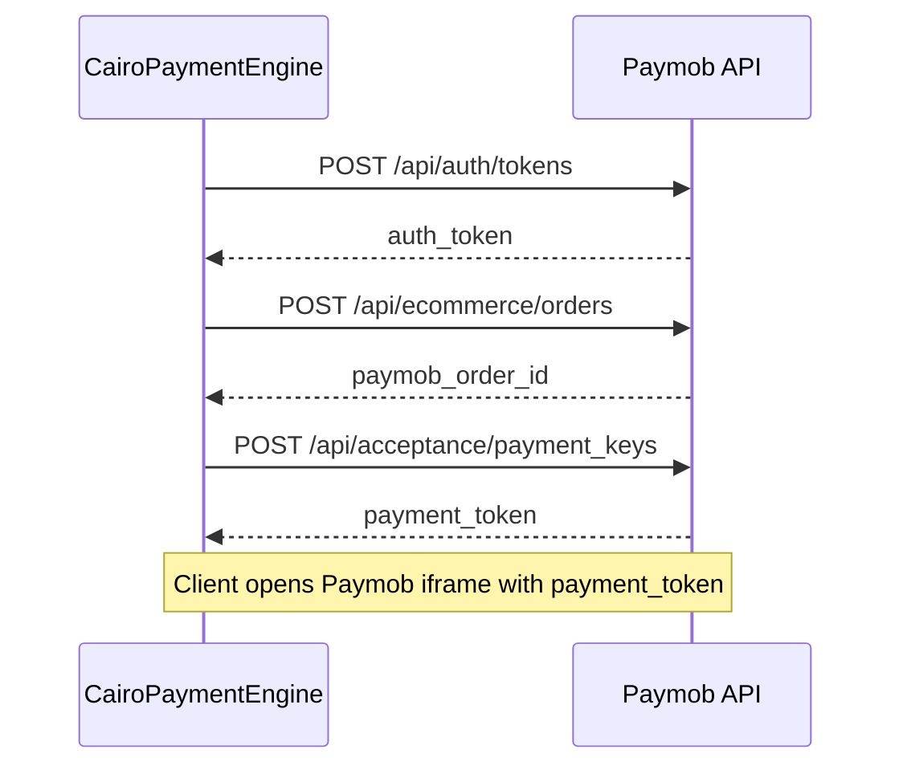

# CairoPaymentEngine

A **production-ready Payment Engine** built with ASP.NET Core 8, Clean Architecture, and SOLID principles — supporting **Stripe** (international) and **Paymob** (Egypt's leading payment gateway).

> Built as a portfolio project to demonstrate real-world payment gateway integration, Clean Architecture, and software design patterns — targeting the Egyptian market.

## 🚀 Live Deployment

[](https://cairopaymentengine-2.onrender.com/healthz)
[](https://cairopaymentengine-2.onrender.com/swagger/index.html)
[](https://cairopaymentengine-3.onrender.com/)

---

### 🧪 Test Flow — Paymob (Egypt 🇪🇬)

> Use currency `EGP` to trigger Paymob gateway

1. Open the [Frontend Dashboard](https://cairopaymentengine-3.onrender.com/)
2. Create an order with currency `EGP`
3. Initiate Paymob payment — iframe will open
4. Complete using Paymob test card
5. Confirm order status transitions to `Paid`

---

### 🧪 Test Flow — Stripe (International 🌍)

> Use currency `USD` to trigger Stripe gateway

1. Create an order with currency `USD`
2. Initiate Stripe payment
3. Complete via Stripe test flow
4. Verify order status transitions to `Paid`
---

## Key Highlights

- **Clean Architecture** — 5 fully separated layers with zero cross-layer leakage
- **SOLID Principles** — applied throughout, not just mentioned
- **Gateway Design Pattern** — add any new gateway with a single class, zero changes elsewhere
- **Real Stripe Integration** — live tested against Stripe Sandbox API
- **Real Paymob Integration** — live tested with iframe card payment (Egypt)
- **Idempotent Webhooks** — safe to receive the same event multiple times
- **Domain Events** — `OrderPaidEvent` raised automatically on payment success
- **Global Exception Handling** — middleware-based, zero try/catch in controllers
- **Options Pattern** — strongly-typed gateway configuration
- **User Secrets** — API keys never committed to source control
- **Unit Tests** — xUnit + Moq + FluentAssertions

---

## Architecture Diagrams

### 1 - Clean Architecture Layers



### 2 - Payment Flow



### 3 - Gateway Pattern



### 4 - Webhook Idempotency



### 5 - Paymob 3-Step Flow



---

## Supported Gateways

| Gateway | Type | Status | Market |
|---|---|---|---|
| **Stripe** | Card / International | Live Tested | Global |
| **Paymob** | Card / Wallet / Cash | Live Tested | Egypt |

---

## SOLID Principles — Where and How

### Single Responsibility Principle

| Class | Responsibility |
|---|---|
| `OrdersController` | HTTP request/response only |
| `PaymentOrchestrator` | Payment flow coordination only |
| `StripeGateway` | Stripe API communication only |
| `ExceptionHandlingMiddleware` | Exception-to-HTTP mapping only |
| `OrderRepository` | Database access for Orders only |

### Open/Closed Principle

```csharp
public interface IPaymentGateway
{
    PaymentGateway GatewayType { get; }
    Task<(string ExternalId, string IdempotencyKey)> CreatePaymentAsync(Order order);
    Task<bool> VerifyPaymentAsync(string externalId, string eventId);
}
```

To add InstaPay: Create `InstaPayGateway : IPaymentGateway` and register in `Program.cs`.
**Zero changes to existing code.** ✅

### Dependency Inversion Principle

```csharp
// Depends on abstraction not concrete implementation
private readonly IEnumerable<IPaymentGateway> _gateways;

// Program.cs wires the concrete implementation
builder.Services.AddHttpClient<IPaymentGateway, StripeGateway>();
```

---

## Design Patterns Used

| Pattern | Where | Why |
|---|---|---|
| **Strategy Pattern** | `IPaymentGateway` + implementations | Switch gateway at runtime |
| **Repository Pattern** | `IOrderRepository`, `IPaymentRepository` | Decouple data access |
| **Orchestrator Pattern** | `PaymentOrchestrator` | Coordinate the payment flow |
| **Options Pattern** | `StripeSettings`, `PaymobSettings` | Strongly-typed configuration |
| **Middleware Pattern** | `ExceptionHandlingMiddleware` | Cross-cutting concern in one place |

---

## Key Engineering Decisions

### Idempotent Webhooks
```csharp
if (payment.ProcessedEventId == eventId)
    return; // Already processed — skip silently
```

### Global Exception Handling
```csharp
var (statusCode, message) = exception switch
{
    OrderNotFoundException ex   => (404, ex.Message),
    OrderNotPayableException ex => (400, ex.Message),
    _                           => (500, "An unexpected error occurred.")
};
```

### Secrets Management
```bash
dotnet user-secrets set "Gateways:Stripe:SecretKey" "sk_test_..."
dotnet user-secrets set "Gateways:Paymob:ApiKey" "YOUR_KEY"
```

---

## Getting Started

### Prerequisites
- .NET 8 SDK
- SQL Server or LocalDB
- Stripe and/or Paymob account

### Setup

```bash
git clone https://github.com/your-username/CairoPaymentEngine.git
cd CairoPaymentEngine/CairoPaymentEngine.Api
```

Configure secrets:
```bash
dotnet user-secrets init

dotnet user-secrets set "Gateways:Stripe:SecretKey" "sk_test_YOUR_KEY"
dotnet user-secrets set "Gateways:Stripe:WebhookSecret" "whsec_YOUR_SECRET"

dotnet user-secrets set "Gateways:Paymob:ApiKey" "YOUR_API_KEY"
dotnet user-secrets set "Gateways:Paymob:IntegrationId" "YOUR_INTEGRATION_ID"
dotnet user-secrets set "Gateways:Paymob:MerchantId" "YOUR_MERCHANT_ID"
dotnet user-secrets set "Gateways:Paymob:HmacSecret" "YOUR_HMAC_SECRET"
```

Run:
```bash
dotnet ef database update
dotnet run
```

Swagger: `https://localhost:7162/swagger`

### Adding a New Gateway

```csharp
// 1. Create
public class InstaPayGateway : IPaymentGateway
{
    public PaymentGateway GatewayType => PaymentGateway.InstaPay;
    public Task<(string, string)> CreatePaymentAsync(Order order) { ... }
    public Task<bool> VerifyPaymentAsync(string externalId, string eventId) { ... }
}

// 2. Register in Program.cs
builder.Services.AddHttpClient<IPaymentGateway, InstaPayGateway>();

// Zero changes anywhere else
```

---

## Render Deployment (Backend + Frontend)

This repository is prepared for production deployment on Render without changing domain logic or payment workflows.

### Required Environment Variables

Backend (`cairopaymentengine-api`):

- `ASPNETCORE_ENVIRONMENT=Production`
- `PORT` (provided automatically by Render)
- `ConnectionStrings__DefaultConnection`
- `CORS_ALLOWED_ORIGINS` (comma-separated; include frontend Render URL)
- `UseHttpsRedirection=false` (recommended on Render web service)
- `Database__RunMigrationsOnStartup=true` (set `false` if you prefer manual migration execution)
- `Gateways__Stripe__PublishableKey`
- `Gateways__Stripe__SecretKey`
- `Gateways__Stripe__WebhookSecret`
- `Gateways__Paymob__ApiKey`
- `Gateways__Paymob__IntegrationId`
- `Gateways__Paymob__IframeId`
- `Gateways__Paymob__HmacSecret`
- `Gateways__Paymob__SecretKey` (optional)
- `Gateways__Paymob__PublicKey` (optional)
- `Gateways__Paymob__MerchantId` (optional)

Frontend (`cairopaymentengine-frontend`):

- `VITE_API_BASE_URL=https://<your-backend>.onrender.com`
- `VITE_PAYMOB_IFRAME_ID=<paymob_iframe_id>`

### Backend Service Setup on Render

Use either `render.yaml` (recommended) or configure manually:

- Build command: `dotnet publish CairoPaymentEngine.Api/CairoPaymentEngine.Api.csproj -c Release -o out`
- Start command: `dotnet out/CairoPaymentEngine.Api.dll`

Production behavior implemented in API:

- Binds to Render port when `PORT` is present (`http://0.0.0.0:${PORT}`)
- Swagger enabled only in Development
- Health endpoint: `/healthz`
- CORS reads from `CORS_ALLOWED_ORIGINS` (fallback to `Cors:AllowedOrigins`)
- Optional auto-migration on startup via `Database__RunMigrationsOnStartup`

### Frontend Service Setup on Render

For `tenantix-frontend`:

- Build command: `npm install && npm run build`
- Publish directory: `dist`
- API base URL is read from `import.meta.env.VITE_API_BASE_URL`

### Database Notes

Current migrations target SQL Server. Keep SQL Server in production by setting `ConnectionStrings__DefaultConnection` to your production SQL Server connection string.

### Webhook Configuration

Stripe:

- Configure webhook endpoint to `https://<your-backend>.onrender.com/api/Webhooks/stripe`
- Set `Gateways__Stripe__WebhookSecret` to the endpoint signing secret from Stripe dashboard

Paymob:

- Configure callback/webhook URL in Paymob dashboard to your deployed backend webhook endpoint
- Set `Gateways__Paymob__HmacSecret` in Render environment variables for verification logic

### Example Stripe Test Flow

1. Create order from dashboard.
2. Initiate payment using Stripe gateway.
3. Trigger Stripe webhook (or confirm from Stripe test dashboard).
4. Verify order/payment transitions to paid state.

### Example Paymob Iframe Flow

1. Create order with currency `EGP`.
2. Initiate payment using Paymob gateway.
3. Open returned Paymob iframe URL.
4. Complete test card transaction.
5. Confirm webhook callback updates order/payment status.

---

## Running Tests

```bash
dotnet test
```

Covers:
- `Order` domain business rules (10 tests)
- `PaymentOrchestrator` — success, failure, and idempotency (6 tests)

---

## Project Structure

```
CairoPaymentEngine/
├── CairoPaymentEngine.Domain/
│   ├── Entities/         Order, Payment
│   ├── Enums/            OrderStatus, PaymentStatus, PaymentGateway
│   ├── Events/           OrderPaidEvent
│   ├── Exceptions/       DomainExceptions
│   └── Common/           BaseEntity, DomainEvent
├── CairoPaymentEngine.Application/
│   ├── Abstractions/     IPaymentGateway, IPaymentService, IOrderRepository
│   ├── DTOs/             Request/Response records
│   └── Service/          PaymentOrchestrator, PaymentService
├── CairoPaymentEngine.Infrastructure/
│   ├── Gateways/         StripeGateway, PaymobGateway
│   ├── Repositories/     OrderRepository, PaymentRepository
│   └── Settings/         StripeSettings, PaymobSettings
├── CairoPaymentEngine.Persistence/
│   ├── Context/          CairoPaymentDbContext
│   └── Migrations/
├── CairoPaymentEngine.Api/
│   ├── Controllers/      OrdersController, WebhooksController
│   ├── Middleware/        ExceptionHandlingMiddleware
│   └── Program.cs
└── CairoPaymentEngine.Tests/
    ├── Domain/            OrderTests
    └── Application/       PaymentOrchestratorTests
```

---

## Author

**Khaled Abd-Elhanan**

Backend developer focused on building clean, scalable systems with real-world integrations.

- Email: [khaldbdalhnan383@gmail.com](mailto:khaldbdalhnan383@gmail.com)
- GitHub: [github.com/Khaled-Elhanan](https://github.com/Khaled-Elhanan)

---

> This project was built to demonstrate Clean Architecture, SOLID principles, and real payment gateway integrations in the Egyptian market. Feel free to use it as a reference or reach out with any questions.

---

## License
MIT
